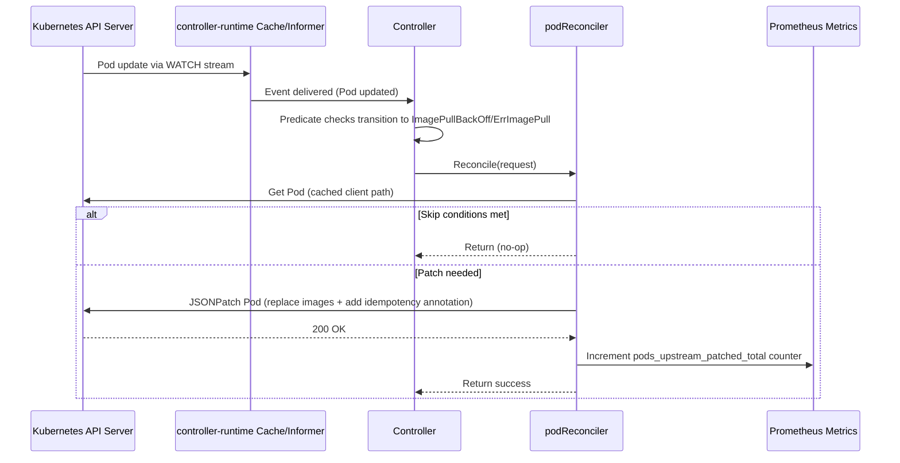

# harbor-reef-operator

Minimal Kubernetes operator that reverts Pod container images from Harbor cache back to original upstream when Pods enter ImagePullBackOff/ErrImagePull.

## Requirements
- Pod annotated with original upstream images using the `harbor.rewrite/original-upstreams` annotation.
- The annotation value is a JSON object mapping container names to their original upstream images:

```yaml
metadata:
  annotations:
    harbor.rewrite/original-upstreams: '{"my-container": "docker.io/library/nginx:latest", "sidecar": "docker.io/library/alpine"}'
```

Recommended to use a policy engine such as Kyverno to annotate pods with this annotation on CREATE

## Features
- No CRDs; watches Pods using controller-runtime informers
- Controller caches pod status and uses event handling to watch pod events
- **Selective patching**: Only patches containers that are actually in ImagePullBackOff/ErrImagePull state, preventing unnecessary restarts of healthy containers
- **Incremental patching**: Can re-process pods when new containers enter ImagePullBackOff (e.g., main containers after init containers complete)
- **Per-container idempotency**: Tracks which containers have been patched in `harbor-reef/patched-containers` annotation to ensure each container is only patched once (prevents loops)
- Adds audit annotation `harbor-reef/patched` with timestamp for logging purposes

### Controller cache and event handling
Uses controller-runtime's shared informer cache. The manager starts informers for Pod resources scoped by `WATCH_NAMESPACE` (comma-separated) or cluster-wide when unset. The cache maintains a consistent local store synchronized via Kubernetes watch streams, not by repeatedly polling all Pods. The manager registers a predicate that filters update events, only reconciling when a Pod transitions into `ImagePullBackOff` or `ErrImagePull`. This means the manager receives events from the API server and reacts; it does not loop over all Pods to check status.

API impact:
- Steady-state uses a long-lived LIST+WATCH per watched namespace (or cluster) managed by the cache, minimizing repeated API calls.
- Reconciles generally perform a single `Get` for the target Pod from the cache client path and issue one JSONPatch `Patch` call only when an update is needed.
- Scope can be reduced with `WATCH_NAMESPACE` to limit cache size and watch traffic when only certain namespaces are relevant.

### Startup sequence
- Register Prometheus metrics (`pods_upstream_patched_total`, `reconcile_errors_total`, `reconcile_duration_seconds`).
- Read `WATCH_NAMESPACE`. If set, watch only the listed namespaces; otherwise scope is cluster-wide.
- Create controller-runtime manager with the configured cache scope.
- Construct `podReconciler` with the manager client.
- Register a controller that watches Pod updates with a predicate. Only transitions into `ImagePullBackOff`/`ErrImagePull` trigger reconciles.
- Start the manager (runs informers and controller workers; stops on SIGTERM/SIGINT).

### When a Pod enters ImagePullBackOff/ErrImagePull
- Fetch the `Pod` by `namespace/name`. Ignore not found.
- Exit early if:
  - Pod is deleting (`metadata.deletionTimestamp` set), or
  - Pod has no annotations, or
  - Pod is no longer in `ImagePullBackOff`/`ErrImagePull`.
- Identify which specific containers are in `ImagePullBackOff`/`ErrImagePull` state.
- Log detection (includes names of waiting containers).
- Read the `harbor-reef/patched-containers` annotation to get the list of containers already patched.
- Build a single JSON6902 patch:
  - Parse the `harbor.rewrite/original-upstreams` JSON annotation to get container→image mappings.
  - For each container and initContainer that is **currently in ImagePullBackOff/ErrImagePull**:
    - Skip if the container was already patched (listed in `patched-containers` annotation).
    - Otherwise, add a `replace` op for `/spec/(init)containers/<index>/image` to the upstream image.
  - If no replace ops were added, stop (nothing to patch).
  - Update `harbor-reef/patched-containers` annotation with the combined list of all patched containers.
  - Update `harbor-reef/patched` annotation with the current UTC timestamp.
- Apply the JSON patch to the Pod. On error, requeue after 15s.
- On success:
  - Log which containers were patched and to which upstream images.
  - Increment `pods_upstream_patched_total` Prometheus counter for each patched container with labels: `patched_kube_namespace`, `patched_pod_name`, `patched_container_name`, `patched_image`.

**Note**: The operator can process the same pod multiple times if different containers enter ImagePullBackOff at different times (e.g., init containers fail first, then main containers fail after init completes). Each container is only patched once - the `patched-containers` annotation ensures idempotency and prevents loops even if the original upstream also fails.

### Prometheus Metrics

The operator exposes the following metrics on the controller-runtime metrics endpoint (default port 8080):

| Metric | Type | Labels | Description |
|--------|------|--------|-------------|
| `pods_upstream_patched_total` | Counter | `patched_kube_namespace`, `patched_pod_name`, `patched_container_name`, `patched_image` | Total number of pod containers patched to use original upstream images |
| `reconcile_errors_total` | Counter | `patched_kube_namespace`, `patched_pod_name`, `error_type` | Total number of reconciliation errors |
| `reconcile_duration_seconds` | Histogram | `patched_kube_namespace`, `result` | Duration of reconciliation operations in seconds |

#### Sequence diagram


## Install via Helm chart

The helm chart is deployed to the [NVIDIA NGC Catalog](https://catalog.ngc.nvidia.com/?tab=helm_chart)

Prerequisites:
```bash
helm repo add ngc https://helm.ngc.nvidia.com/nvidia
helm repo update
```

Install/Upgrade from NGC:
```bash
helm upgrade --install harbor-reef-operator \
  ngc/harbor-reef-operator \
  --namespace harbor-reef-operator \
  -f values.yaml
```

See helm chart [README](./helm-charts/harbor-reef-operator/README.md) for values documentation.

Render templates (OCI chart):
```bash
helm template harbor-reef-operator ngc/harbor-reef-operator -n ${NAMESPACE}$ --version ${VERSION} -f values.yaml
```

Uninstall:
```bash
helm uninstall harbor-reef-operator
```

## Contribution Guidelines
- See here: [CONTRIBUTING.md](./CONTRIBUTING.md)

## Security
- Vulnerability disclosure: [SECURITY.md](./SECURITY.md)
- Do not file public issues for security reports.

# License
This project is licensed under the Apache 2.0 License - see the [LICENSE](./LICENSE) file for details
