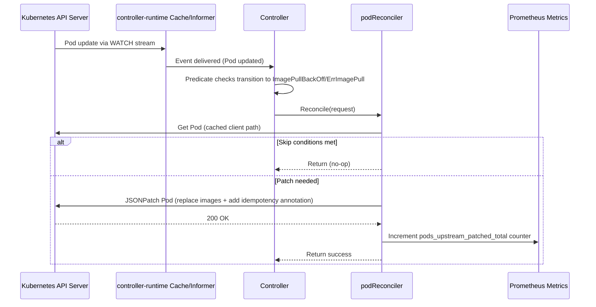

# harbor-reef-operator

Kubernetes operator for the Harbor Reef image caching system. It provides two controllers:

1. **Pod Fallback Controller** -- Reverts Pod container images from Harbor cache back to original upstream when Pods enter ImagePullBackOff/ErrImagePull.
2. **ProxyCache Controller** -- Reconciles `ProxyCache` custom resources to declaratively manage Harbor registry endpoints and proxy-cache projects.

## Project Structure

The operator follows a [kubebuilder-style](https://book-v1.book.kubebuilder.io/basics/project_creation_and_structure) Go package layout:

```
main.go                            # Manager bootstrap, scheme registration, controller wiring
pkg/
  apis/v1alpha1/                   # API resource definitions (ProxyCache CRD types)
  controller/
    pod/reconciler.go              # Pod fallback controller
    proxycache/reconciler.go       # ProxyCache controller
  harbor/client.go                 # Harbor v2.0 REST API client
Dockerfile
helm-charts/
  harbor-reef-operator/            # Operator Helm chart (CRDs, RBAC, Deployment)
```

## Pod Fallback Controller

### Requirements
- Pod annotated with original upstream images using the `harbor.rewrite/original-upstreams` annotation.
- The annotation value is a JSON object mapping container names to their original upstream images:

```yaml
metadata:
  annotations:
    harbor.rewrite/original-upstreams: '{"my-container": "docker.io/library/nginx:latest", "sidecar": "docker.io/library/alpine"}'
```

Recommended to use a policy engine such as Kyverno to annotate pods with this annotation on CREATE

### Features
- Watches Pods using controller-runtime informers
- Controller caches pod status and uses event handling to watch pod events
- **Selective patching**: Only patches containers that are actually in ImagePullBackOff/ErrImagePull state, preventing unnecessary restarts of healthy containers
- **Incremental patching**: Can re-process pods when new containers enter ImagePullBackOff (e.g., main containers after init containers complete)
- **Per-container idempotency**: Tracks which containers have been patched in `harbor-reef/patched-containers` annotation to ensure each container is only patched once (prevents loops)
- Adds audit annotation `harbor-reef/patched` with timestamp for logging purposes

### Cache and event handling
Uses controller-runtime's shared informer cache. The manager starts informers for Pod resources scoped by `WATCH_NAMESPACE` (comma-separated) or cluster-wide when unset. The cache maintains a consistent local store synchronized via Kubernetes watch streams, not by repeatedly polling all Pods. The manager registers a predicate that filters update events, only reconciling when a Pod transitions into `ImagePullBackOff` or `ErrImagePull`. This means the manager receives events from the API server and reacts; it does not loop over all Pods to check status.

API impact:
- Steady-state uses a long-lived LIST+WATCH per watched namespace (or cluster) managed by the cache, minimizing repeated API calls.
- Reconciles generally perform a single `Get` for the target Pod from the cache client path and issue one JSONPatch `Patch` call only when an update is needed.
- Scope can be reduced with `WATCH_NAMESPACE` to limit cache size and watch traffic when only certain namespaces are relevant.

### Startup sequence
- Register Prometheus metrics (`pods_upstream_patched_total`, `reconcile_errors_total`, `reconcile_duration_seconds`).
- Read `WATCH_NAMESPACE`. If set, watch only the listed namespaces; otherwise scope is cluster-wide.
- Create controller-runtime manager with the configured cache scope.
- Construct `pod.Reconciler` and call `SetupWithManager` to register a controller that watches Pod updates with a predicate. Only transitions into `ImagePullBackOff`/`ErrImagePull` trigger reconciles.
- If `HARBOR_URL` is set, construct `proxycache.Reconciler` and call `SetupWithManager` to watch `ProxyCache` custom resources (see below).
- Start the manager (runs informers and controller workers; stops on SIGTERM/SIGINT).

### When a Pod enters ImagePullBackOff/ErrImagePull
- Fetch the `Pod` by `namespace/name`. Ignore not found.
- Exit early if:
  - Pod is deleting (`metadata.deletionTimestamp` set), or
  - Pod has no annotations, or
  - Pod is no longer in `ImagePullBackOff`/`ErrImagePull`.
- Identify which specific containers are in `ImagePullBackOff`/`ErrImagePull` state.
- Log detection (includes names of waiting containers).
- Read the `harbor-reef/patched-containers` annotation to get the list of containers already patched.
- Build a single JSON6902 patch:
  - Parse the `harbor.rewrite/original-upstreams` JSON annotation to get container→image mappings.
  - For each container and initContainer that is **currently in ImagePullBackOff/ErrImagePull**:
    - Skip if the container was already patched (listed in `patched-containers` annotation).
    - Otherwise, add a `replace` op for `/spec/(init)containers/<index>/image` to the upstream image.
  - If no replace ops were added, stop (nothing to patch).
  - Update `harbor-reef/patched-containers` annotation with the combined list of all patched containers.
  - Update `harbor-reef/patched` annotation with the current UTC timestamp.
- Apply the JSON patch to the Pod. On error, requeue after 15s.
- On success:
  - Log which containers were patched and to which upstream images.
  - Increment `pods_upstream_patched_total` Prometheus counter for each patched container with labels: `patched_kube_namespace`, `patched_pod_name`, `patched_container_name`, `patched_image`.

**Note**: The operator can process the same pod multiple times if different containers enter ImagePullBackOff at different times (e.g., init containers fail first, then main containers fail after init completes). Each container is only patched once - the `patched-containers` annotation ensures idempotency and prevents loops even if the original upstream also fails.

### Prometheus Metrics

The operator exposes the following metrics on the controller-runtime metrics endpoint (default port 8080):

| Metric | Type | Labels | Description |
|--------|------|--------|-------------|
| `pods_upstream_patched_total` | Counter | `patched_kube_namespace`, `patched_pod_name`, `patched_container_name`, `patched_image` | Total number of pod containers patched to use original upstream images |
| `reconcile_errors_total` | Counter | `patched_kube_namespace`, `patched_pod_name`, `error_type` | Total number of reconciliation errors |
| `reconcile_duration_seconds` | Histogram | `patched_kube_namespace`, `result` | Duration of reconciliation operations in seconds |

#### Sequence diagram


## ProxyCache Controller

The ProxyCache controller manages Harbor registry endpoints and proxy-cache projects declaratively via the `ProxyCache` custom resource (`harbor-reef.nvidia.com/v1alpha1`).

The controller is **opt-in**: it only activates when the `HARBOR_URL` environment variable is set.

### ProxyCache CRD

The CRD is cluster-scoped.

```yaml
apiVersion: harbor-reef.nvidia.com/v1alpha1
kind: ProxyCache
metadata:
  name: proxy-public
spec:
  type: public            # "public", "private", or "aws-ecr-private"
  name: proxy-public      # Harbor registry endpoint and project name
  url: https://registry.example.com
```

Three proxy cache types are supported:

| Type | Description | Required Fields |
|------|-------------|-----------------|
| `public` | Public registry, no credentials | `name`, `url` |
| `private` | Private registry with basic auth | `name`, `url`, `credentials.secretName` |
| `aws-ecr-private` | AWS ECR with static credentials | `name`, `ecr.accountId`, `ecr.staticCredentialsSecretName` |

**Private registry example:**
```yaml
apiVersion: harbor-reef.nvidia.com/v1alpha1
kind: ProxyCache
metadata:
  name: proxy-private
spec:
  type: private
  name: proxy-private
  url: https://private.registry.example.com
  credentials:
    secretName: private-registry-credentials
    usernameKey: username      # default: "username"
    passwordKey: password      # default: "password"
```

**AWS ECR example:**
```yaml
apiVersion: harbor-reef.nvidia.com/v1alpha1
kind: ProxyCache
metadata:
  name: proxy-ecr
spec:
  type: aws-ecr-private
  name: proxy-ecr
  ecr:
    accountId: "123456789012"
    region: us-west-2
    staticCredentialsSecretName: ecr-static-credentials
```

### Configuration

The controller reads Harbor connection details from environment variables:

| Variable | Description | Default |
|----------|-------------|---------|
| `HARBOR_URL` | Harbor Core internal URL (e.g., `http://harbor-core.harbor.svc`) | *(empty -- controller disabled)* |
| `HARBOR_ADMIN_SECRET` | Name of the K8s Secret containing the Harbor admin password | `harbor-admin-password` |
| `HARBOR_ADMIN_SECRET_KEY` | Key within the secret that holds the password | `HARBOR_ADMIN_PASSWORD` |
| `HARBOR_RETAIN_ON_DELETE` | When `true`, deleting a `ProxyCache` CR removes the finalizer without touching Harbor (registry endpoint, project, and cached repositories are preserved). | `false` (cascade delete) |

Credential secrets referenced by `private` and `aws-ecr-private` ProxyCache resources are looked up in the operator's own namespace (`POD_NAMESPACE`). The controller watches Secrets in that namespace so creating or updating a referenced credential secret -- or the Harbor admin secret -- auto-reconciles the affected ProxyCache(s) without waiting for the requeue tick.

### Reconciliation flow

1. Fetch the `ProxyCache` resource.
2. Read the Harbor admin password from the configured Kubernetes Secret.
3. Depending on the type:
   - **public**: Create/verify the registry endpoint and a public proxy project.
   - **private**: Read credentials from the referenced secret, create/verify the registry endpoint with basic auth and a private proxy project.
   - **aws-ecr-private**: Read ECR credentials, construct the ECR URL, create/verify the registry endpoint and a private proxy project.
4. Update the `ProxyCache` status with `phase: Ready`, `registryId`, and `projectCreated: true`.
5. On error, set `phase: Error` with a descriptive message and requeue after 30 seconds.

All Harbor API calls are idempotent -- existing endpoints and projects are detected and skipped.

### Deletion

ProxyCache resources carry the `harbor-reef.nvidia.com/proxycache-finalizer` finalizer so the operator can clean up Harbor state before the CR is garbage-collected.

By default (`HARBOR_RETAIN_ON_DELETE=false`), `kubectl delete proxycache` triggers a cascade:

1. Empty the proxy project by deleting every cached repository (Harbor refuses to delete a project that still contains repositories).
2. Delete the proxy project.
3. Delete the registry endpoint.
4. Remove the finalizer.

When `HARBOR_RETAIN_ON_DELETE=true`, the operator skips steps 1--3 entirely. The finalizer is still removed so the CR can be GC'd, but the Harbor registry endpoint, project, and any cached repositories are preserved for manual cleanup or reuse. Useful when retiring an operator deployment without nuking shared Harbor state.

### Status

```bash
kubectl get proxycaches
# or
kubectl get hpc
```

```
NAME            TYPE              PHASE   AGE
proxy-public    public            Ready   5m
proxy-private   private           Ready   5m
proxy-ecr       aws-ecr-private   Ready   5m
```

## Install via Helm chart

The helm chart is deployed to the [NVIDIA NGC Catalog](https://catalog.ngc.nvidia.com/?tab=helm_chart)

Prerequisites:
```bash
helm repo add ngc https://helm.ngc.nvidia.com/nvidia
helm repo update
```

Install/Upgrade from NGC:
```bash
helm upgrade --install harbor-reef-operator \
  ngc/harbor-reef-operator \
  --namespace harbor-reef-operator \
  -f values.yaml
```

See helm chart [README](./helm-charts/harbor-reef-operator/README.md) for values documentation.

Render templates (OCI chart):
```bash
helm template harbor-reef-operator ngc/harbor-reef-operator -n ${NAMESPACE}$ --version ${VERSION} -f values.yaml
```

Uninstall:
```bash
helm uninstall harbor-reef-operator
```

## Testing

Unit tests:

```bash
make test
```

End-to-end tests against a live cluster + Harbor (chainsaw):

```bash
make chainsaw-install   # one-time
make chainsaw           # runs against current kube context
```

The chainsaw suite covers seams that unit tests cannot reach: CRD schema
enforcement at admission time, the operator's RBAC (cascade delete with a
cached repository), and the controller-runtime Secret-watch wiring. See
[test/chainsaw/README.md](./test/chainsaw/README.md) for details.

## Contribution Guidelines
- See here: [CONTRIBUTING.md](./CONTRIBUTING.md)

## Security
- Vulnerability disclosure: [SECURITY.md](./SECURITY.md)
- Do not file public issues for security reports.

## License
This project is licensed under the Apache 2.0 License - see the [LICENSE](./LICENSE) file for details
